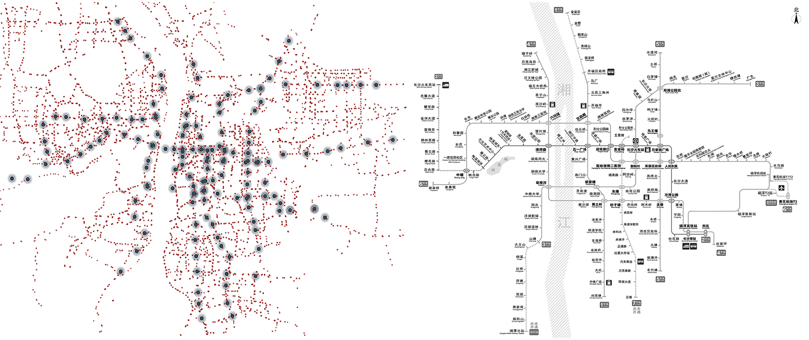

## Welcome to Crowd Bus Sensing Pages

In recent years, an increasing number of map apps have provided route planning services to their users. However, the quality of route planning services relies heavily on having correct data about transportation infrastructure. As many planned subway lines are being built across cities, there are conflicts between the actual conditions and the data provided by map apps for temporary bus stops, which may result in complaints against public transportation operators. However, it is difficult to tackle these complaints, as the public transportation operators can obtain only inaccurate information about the locations of temporary bus stops. To resolve these conflicts, crowd bus sensing (CBS) is proposed in this paper. CBS is a new sensing paradigm that takes advantage of the extensive deployment of GPS trackers and prior knowledge about the transportation infrastructures covered by scheduled bus routes. Extensive experimental evaluations on real-world and synthetic datasets show that the proposed CBS system outperforms state-of-the-art methods.

## Coarse-grained Distribution of Temporary Bus Stops

##  Part of Dataset for  Crowd Bus Sensing

In accordance with national privacy issues，part of our dataset can be accessed from the CrowdBusSensing repository: [Crow Bus Sensing Dataset](https://github.com/tntxie/CrowdBusSensing). 

